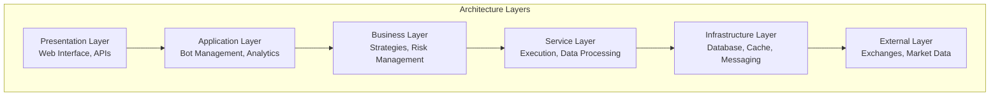
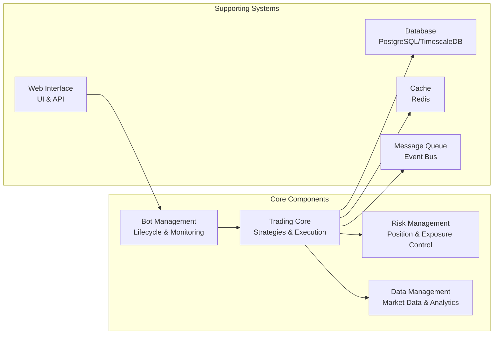
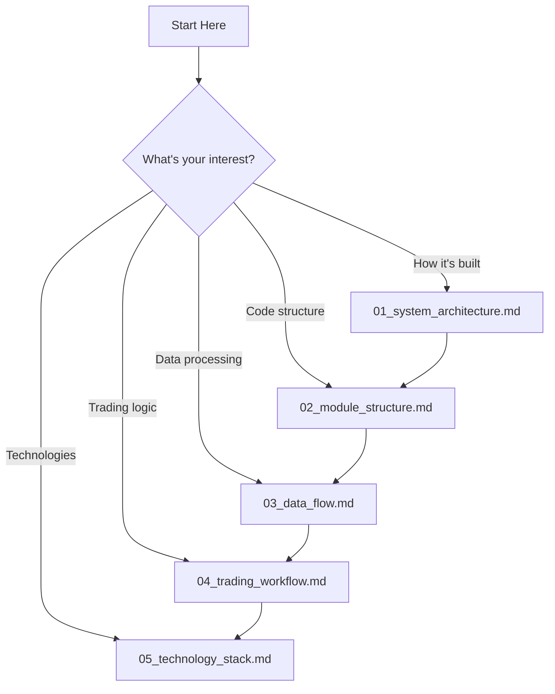

# T-Bot Trading System - Architecture Documentation

## 📚 Architecture Documentation Index

This directory contains comprehensive architecture documentation for the T-Bot trading system. Follow these documents in order to understand the system from top-level to detailed implementation.

### Documentation Structure

1. **[00_overview.md](00_overview.md)** - This index file
2. **[01_system_architecture.md](01_system_architecture.md)** - High-level system architecture
3. **[02_module_structure.md](02_module_structure.md)** - Module organization and dependencies
4. **[03_data_flow.md](03_data_flow.md)** - How data flows through the system
5. **[04_trading_workflow.md](04_trading_workflow.md)** - Complete trading execution flow
6. **[05_technology_stack.md](05_technology_stack.md)** - Technologies and frameworks used

### System Overview

### Key Architectural Principles

| Principle | Description | Implementation |
|-----------|-------------|----------------|
| **Layered Architecture** | Strict separation of concerns | Controllers → Services → Repositories |
| **Domain-Driven Design** | Business logic encapsulation | Domain models in `core/types/` |
| **Dependency Injection** | Loose coupling | DI container in `core/di.py` |
| **Event-Driven** | Asynchronous operations | Event bus, WebSocket, async/await |
| **Financial Precision** | Accurate monetary calculations | Decimal types, never float |
| **Fault Tolerance** | Resilient to failures | Circuit breakers, retries, monitoring |

### Main Components

### Quick Navigation

**By Concern:**
- **System Design** → [01_system_architecture.md](01_system_architecture.md)
- **Code Organization** → [02_module_structure.md](02_module_structure.md)
- **Data Processing** → [03_data_flow.md](03_data_flow.md)
- **Trading Logic** → [04_trading_workflow.md](04_trading_workflow.md)
- **Tech Details** → [05_technology_stack.md](05_technology_stack.md)

**By Role:**
- **Developers**: Start with module structure (02) then data flow (03)
- **Architects**: Review system architecture (01) and technology stack (05)
- **Traders**: Focus on trading workflow (04) and data flow (03)
- **DevOps**: Check technology stack (05) and system architecture (01)

### Interactive Learning Path

---

## Next Steps

**Choose your learning path:**

1. **System Architecture** - Understand the big picture
2. **Module Structure** - Learn code organization
3. **Data Flow** - See how market data is processed
4. **Trading Workflow** - Follow a trade from signal to execution
5. **Technology Stack** - Deep dive into tools and frameworks

What would you like to explore? (Choose 1-5)