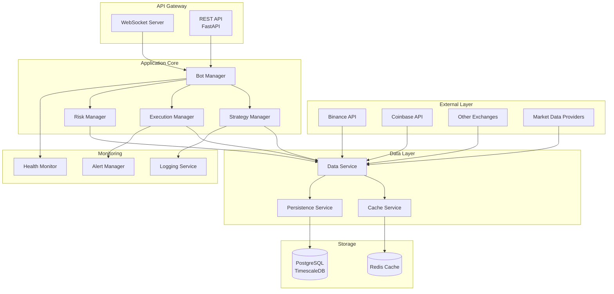
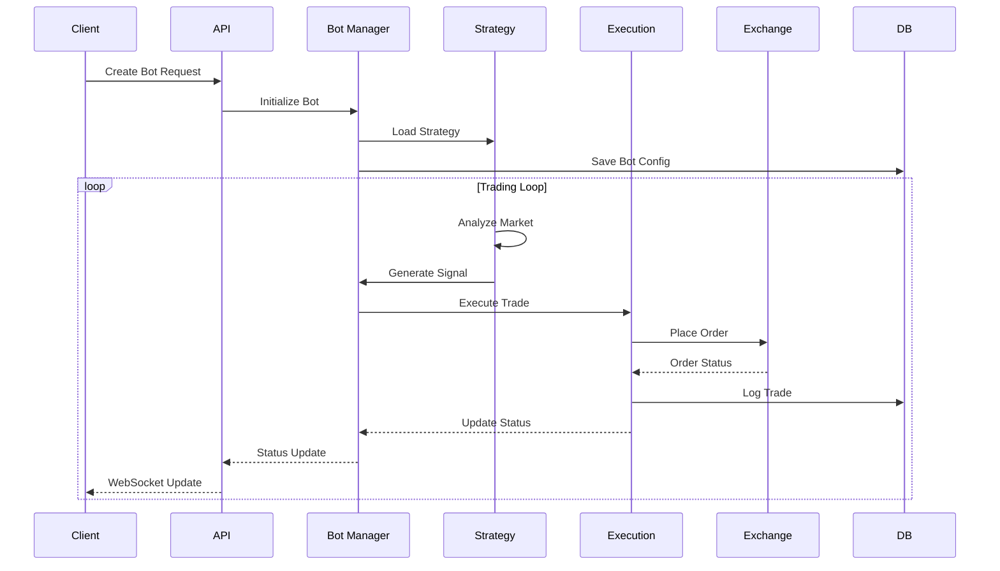
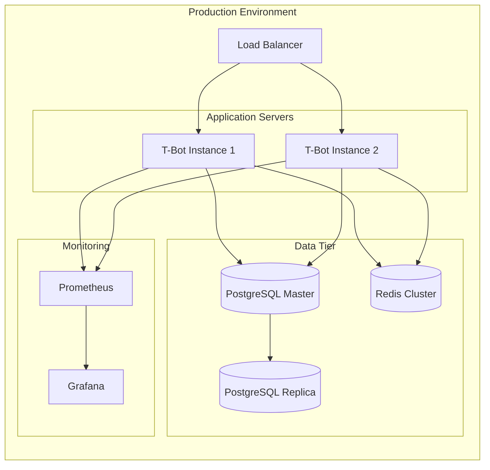
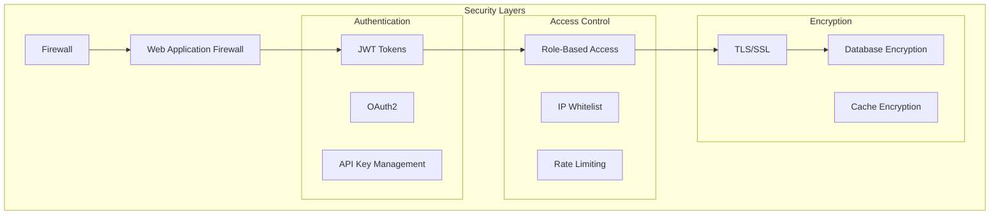

# T-Bot System Architecture

## High-Level Architecture

## System Components

### 1. External Integration Layer
- **Exchange Adapters**: Standardized interface for multiple exchanges
- **Market Data Feed**: Real-time price and volume data
- **Order Routing**: Smart order routing across exchanges

### 2. Application Core
- **Bot Manager**: Lifecycle management of trading bots
- **Strategy Manager**: Strategy selection and parameter optimization
- **Execution Manager**: Order placement and management
- **Risk Manager**: Position sizing, stop-loss, exposure control

### 3. Data Management
- **Data Service**: Centralized data access and transformation
- **Cache Service**: Redis-based caching for performance
- **Persistence Service**: Database operations via repositories

### 4. Infrastructure
- **PostgreSQL + TimescaleDB**: Time-series data storage
- **Redis**: Caching and real-time data
- **Event Bus**: Asynchronous message passing

## Communication Patterns

## Deployment Architecture

## Security Architecture

---

## Next Steps

**Continue exploring:**

1. **[Module Structure](02_module_structure.md)** - Detailed code organization
2. **[Data Flow](03_data_flow.md)** - How data moves through the system
3. **[Trading Workflow](04_trading_workflow.md)** - Complete trade execution
4. **[Technology Stack](05_technology_stack.md)** - Tools and frameworks
5. **[Back to Overview](00_overview.md)** - Return to index

What would you like to explore next? (Choose 1-5)