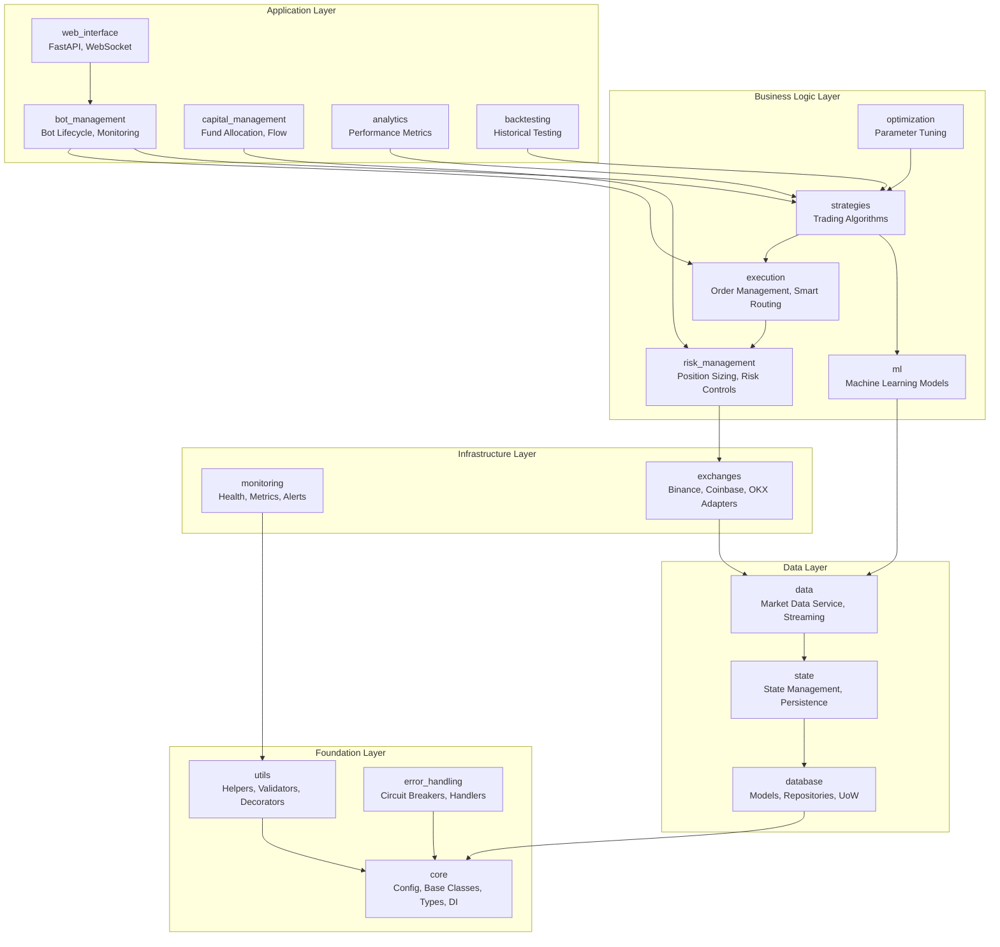

# T-Bot Module Structure

## Actual Module Organization

Based on the actual codebase structure in `src/`, here are the 19 modules:



## Module Details (From Actual Code)

### Core Module (`src/core/`)
```
core/
├── __init__.py
├── base/
│   ├── component.py      # BaseComponent class
│   ├── service.py        # BaseService class
│   └── factory.py        # Factory pattern base
├── types/
│   ├── __init__.py       # Export all types
│   ├── bot.py            # Bot-related types
│   ├── risk.py           # Risk management types
│   └── strategy.py       # Strategy types
├── config.py             # Configuration management
├── di.py                 # Dependency injection container
├── exceptions.py         # Custom exceptions
├── logging.py            # Structured logging
├── events.py             # Event system
└── data_transformer.py   # Core DTO transformations
```

### Database Module (`src/database/`)
```
database/
├── models/
│   ├── bot.py            # Bot entity
│   ├── bot_instance.py   # Bot instance entity
│   ├── trading.py        # Trade, Order entities
│   ├── capital.py        # Capital allocation
│   ├── optimization.py   # Optimization results
│   ├── backtesting.py    # Backtest results
│   ├── state.py          # State persistence
│   ├── system.py         # System configuration
│   └── user.py           # User management
├── repository.py         # Base repository pattern
├── service.py            # Database service
├── uow.py                # Unit of Work pattern
└── redis_client.py       # Redis cache client
```

### Bot Management Module (`src/bot_management/`)
```
bot_management/
├── service.py            # Main bot service
├── bot_instance.py       # Bot instance management
├── bot_coordinator.py    # Multi-bot coordination
├── bot_monitor.py        # Bot health monitoring
├── resource_manager.py   # Resource allocation
├── resource_service.py   # Resource management service
├── factory.py            # Bot factory
└── di_registration.py    # DI setup
```

### Strategies Module (`src/strategies/`)
```
strategies/
├── base.py               # BaseStrategy abstract class
├── static/               # Static strategies
│   ├── trend_following.py
│   ├── spread_optimizer.py
│   └── inventory_manager.py
├── dynamic/              # Dynamic adaptive strategies
│   ├── adaptive_momentum.py
│   ├── volatility_breakout.py
│   └── strategy_factory.py
├── hybrid/               # Hybrid strategies
│   ├── ensemble.py
│   ├── fallback.py
│   └── rule_based_ai.py
├── evolutionary/         # Evolutionary strategies
│   └── fitness.py
├── service.py            # Strategy service
├── repository.py         # Strategy persistence
├── validation.py         # Strategy validation
└── performance_monitor.py # Performance tracking
```

### Web Interface Module (`src/web_interface/`)
```
web_interface/
├── app.py                # FastAPI application
├── api/                  # API endpoints
│   ├── analytics.py
│   ├── auth.py
│   ├── bot_management.py
│   ├── capital.py
│   ├── data.py
│   ├── exchanges.py
│   ├── optimization.py
│   ├── risk.py
│   ├── state_management.py
│   ├── strategies.py
│   └── trading.py
├── services/             # Web-specific services
│   ├── bot_service.py
│   ├── capital_service.py
│   ├── risk_service.py
│   ├── strategy_service.py
│   └── trading_service.py
├── facade/               # Service facade pattern
│   ├── api_facade.py
│   └── service_registry.py
├── middleware/           # FastAPI middleware
│   ├── error_handler.py
│   └── decimal_precision.py
├── security/             # Authentication
│   └── auth.py
├── socketio_manager.py   # WebSocket management
└── versioning/           # API versioning
    └── version_manager.py
```

## Module Communication Patterns

### Service Layer Pattern (Actual Implementation)
```python
# From src/bot_management/service.py
from src.core.base.service import BaseService
from src.core.events import BotEvent, BotEventType, get_event_publisher
from src.core.exceptions import ServiceError, ValidationError

class BotManagementService(BaseService):
    def __init__(self, ...):
        # Dependencies injected via DI container
        self.strategy_service = strategy_service
        self.execution_service = execution_service
        self.risk_service = risk_service
```

### Repository Pattern (Actual Implementation)
```python
# Standard repository interface used across modules
class BaseRepository:
    async def create(self, entity: T) -> T
    async def get(self, id: UUID) -> T | None
    async def update(self, entity: T) -> T
    async def delete(self, id: UUID) -> bool
    async def list(self, filters: dict) -> list[T]
```

### Event-Driven Communication
```python
# From src/core/events.py
class BotEvent:
    bot_id: UUID
    event_type: BotEventType
    timestamp: datetime
    data: dict

# Publishing events
publisher = get_event_publisher()
await publisher.publish(event)
```

## Module Dependencies Graph (From Imports)

Based on actual import analysis:

| Module | Direct Dependencies | Purpose |
|--------|-------------------|----------|
| `core` | None | Foundation for all modules |
| `utils` | `core` | Helper functions and decorators |
| `error_handling` | `core`, `utils` | Error handling infrastructure |
| `database` | `core`, `utils` | Data persistence layer |
| `state` | `core`, `database` | State management |
| `data` | `core`, `state`, `database` | Market data processing |
| `monitoring` | `core`, `utils` | System monitoring |
| `exchanges` | `core`, `data` | Exchange integrations |
| `risk_management` | `core`, `exchanges` | Risk controls |
| `execution` | `core`, `risk_management`, `exchanges` | Order execution |
| `ml` | `core`, `data` | Machine learning models |
| `strategies` | `core`, `ml`, `execution` | Trading strategies |
| `optimization` | `core`, `strategies`, `backtesting` | Strategy optimization |
| `bot_management` | `core`, `strategies`, `execution`, `capital_management` | Bot lifecycle |
| `capital_management` | `core`, `risk_management` | Fund management |
| `analytics` | `core`, `database` | Performance analytics |
| `backtesting` | `core`, `strategies`, `data` | Historical testing |
| `web_interface` | All modules via facade | API and UI |

---

## Next Steps

**Continue exploring:**

1. **[Data Flow](03_data_flow.md)** - How market data flows through modules
2. **[Trading Workflow](04_trading_workflow.md)** - Complete trade execution path
3. **[Technology Stack](05_technology_stack.md)** - Technologies and frameworks
4. **[Back to Overview](00_overview.md)** - Return to index

What would you like to explore next? (Choose 1-4)