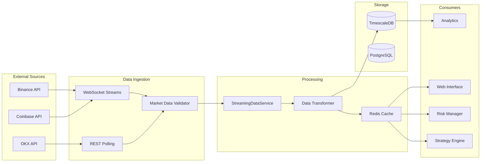
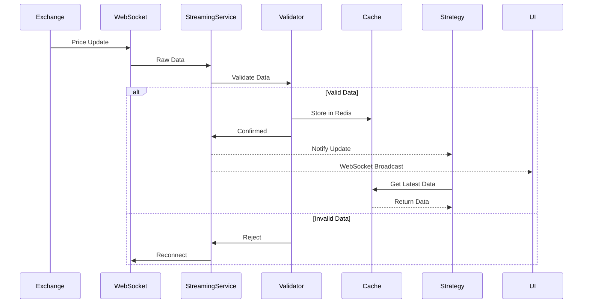
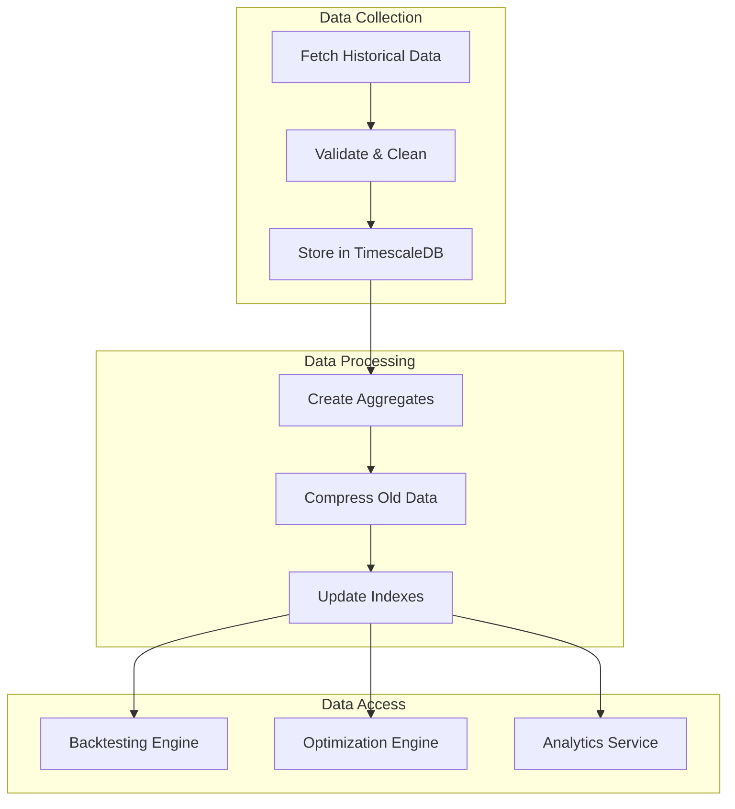
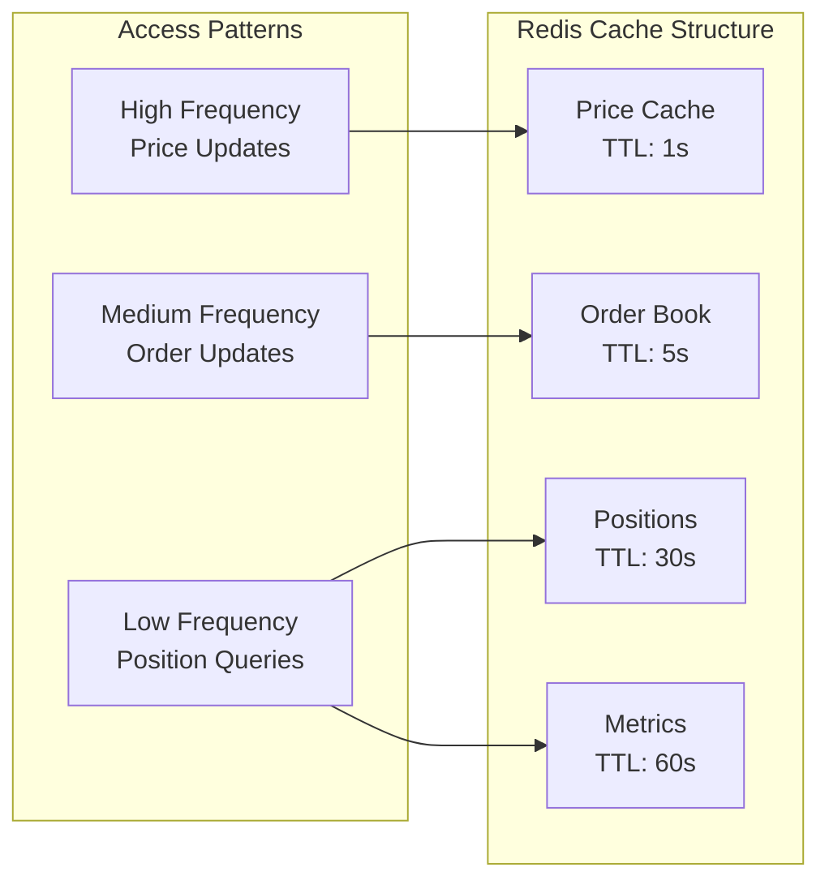
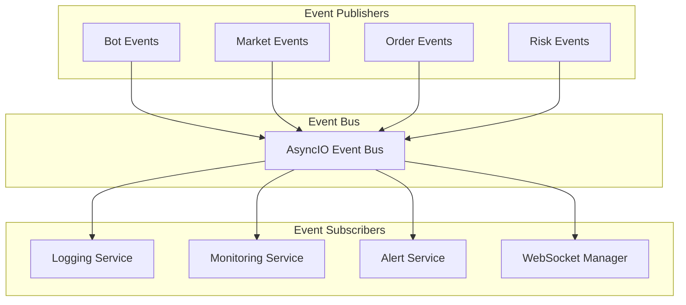
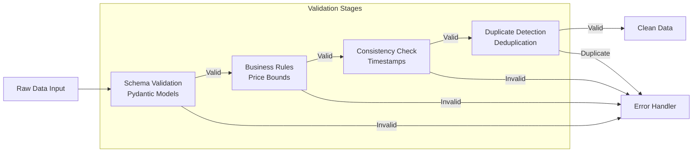
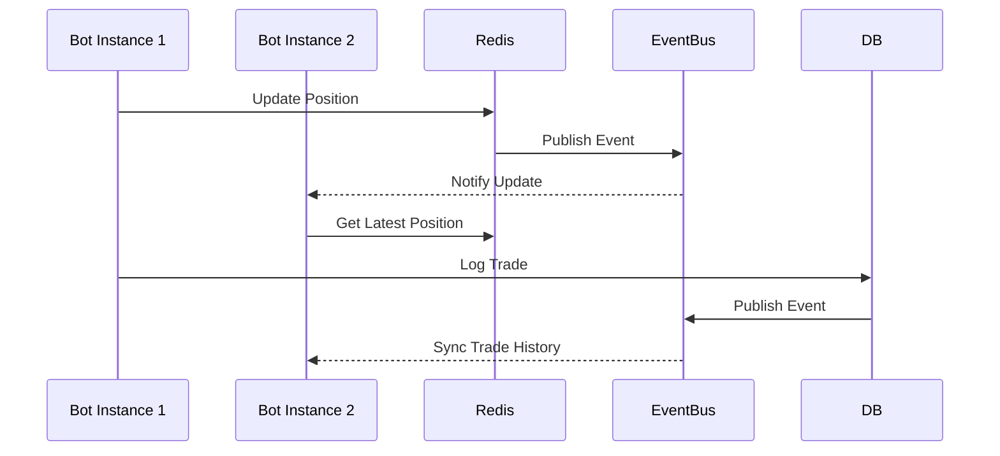
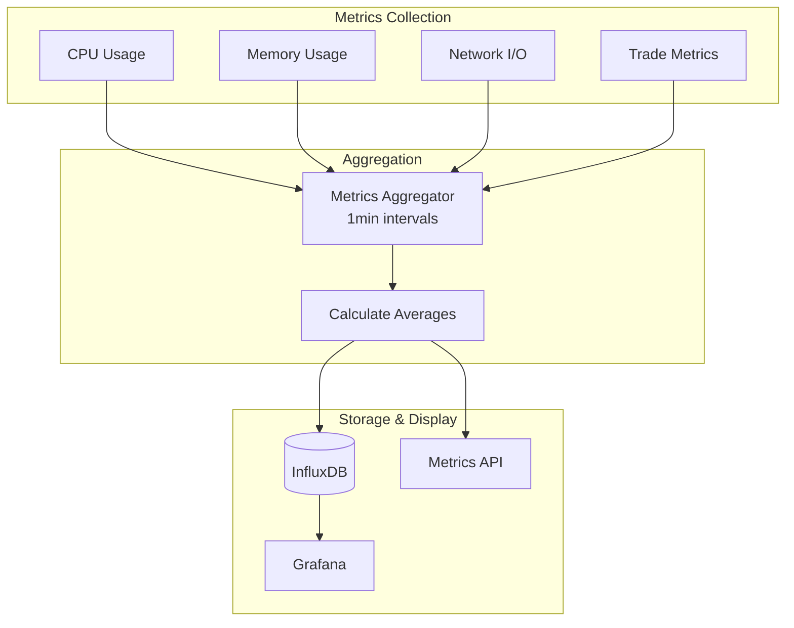

# T-Bot Data Flow Architecture

## Market Data Flow



## Data Processing Pipeline

### 1. Real-Time Market Data Flow



### 2. Historical Data Flow



## Data Models & Structures

### Market Data Structure (Actual from Code)
```python
# From src/core/types/market.py
class MarketData:
    symbol: str
    exchange: str
    timestamp: datetime
    bid: Decimal
    ask: Decimal
    last_price: Decimal
    volume_24h: Decimal
    bid_size: Decimal
    ask_size: Decimal
```

### Order Flow
```python
# From src/core/types/trading.py
class Order:
    order_id: UUID
    bot_id: UUID
    symbol: str
    side: OrderSide  # BUY/SELL
    order_type: OrderType  # MARKET/LIMIT
    quantity: Decimal
    price: Decimal | None
    status: OrderStatus
    timestamp: datetime
```

## Data Storage Layers

### 1. Hot Storage (Redis Cache)


### 2. Warm Storage (PostgreSQL)
```
Tables:
├── trades            # Recent trade executions
├── orders            # Order history
├── positions         # Current positions
├── bot_instances     # Bot configurations
└── strategies        # Strategy parameters
```

### 3. Cold Storage (TimescaleDB)
```
Hypertables:
├── market_data       # Price history (compressed)
├── order_history     # Historical orders
├── trade_history     # Historical trades
└── performance_metrics # Bot performance over time
```

## Event-Driven Data Flow



## Data Validation Pipeline



## Real-Time Data Synchronization



## Performance Metrics Flow



## Data Consistency Guarantees

| Layer | Consistency Model | Implementation |
|-------|------------------|----------------|
| **Cache** | Eventually Consistent | TTL-based expiration |
| **Database** | Strong Consistency | ACID transactions |
| **Event Bus** | At-least-once delivery | Retry with idempotency |
| **WebSocket** | Best-effort | Reconnect on failure |
| **TimescaleDB** | Strong Consistency | Hypertable constraints |

---

## Next Steps

**Continue exploring:**

1. **[Trading Workflow](04_trading_workflow.md)** - Complete trade execution flow
2. **[Technology Stack](05_technology_stack.md)** - Technologies and frameworks
3. **[Module Structure](02_module_structure.md)** - Back to module details
4. **[Back to Overview](00_overview.md)** - Return to index

What would you like to explore next? (Choose 1-4)