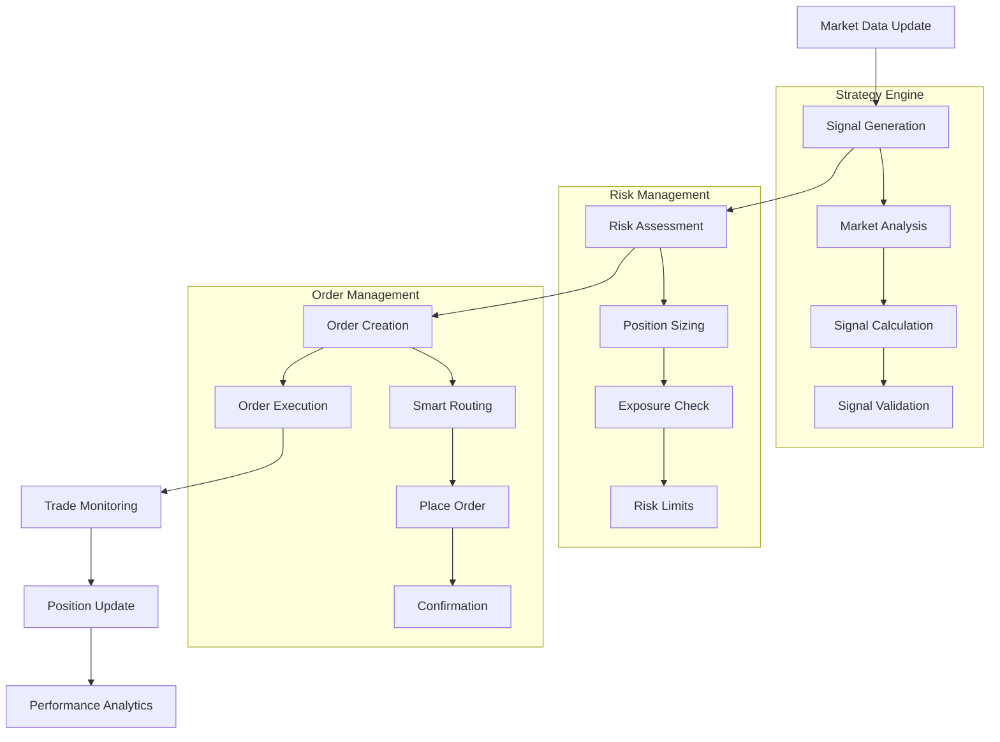
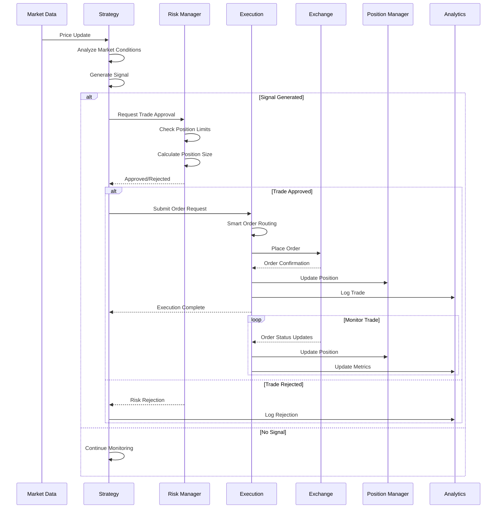
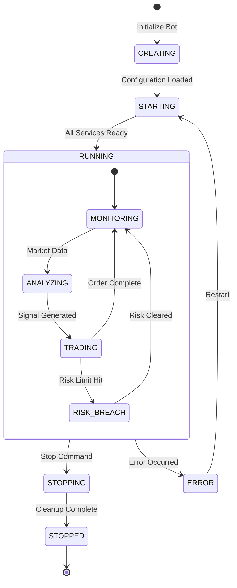
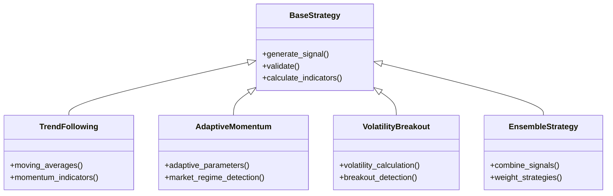
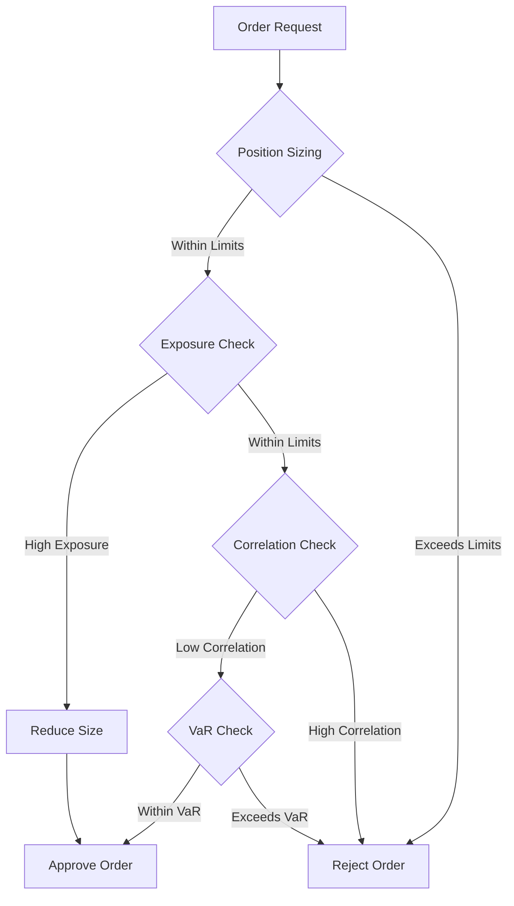
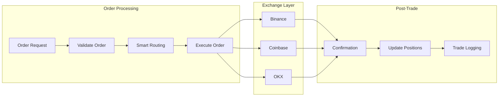
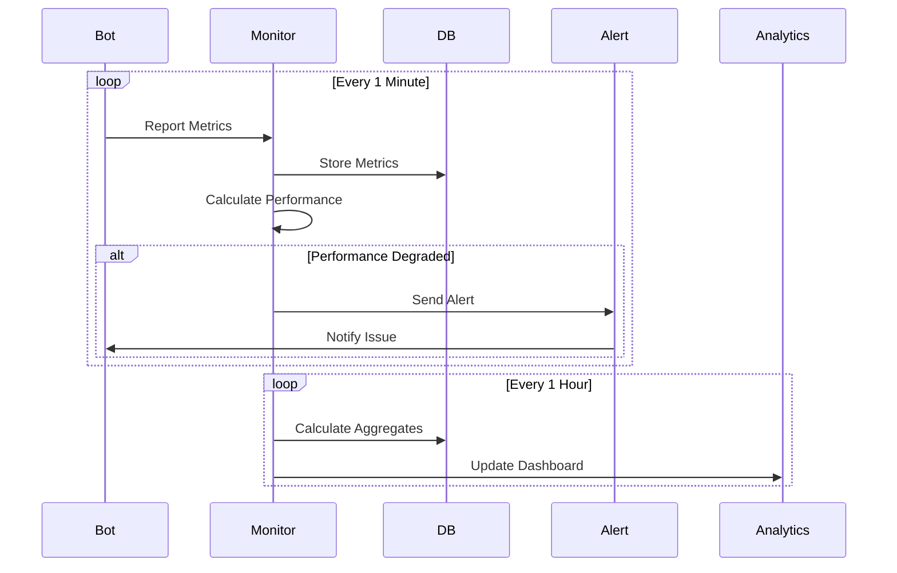
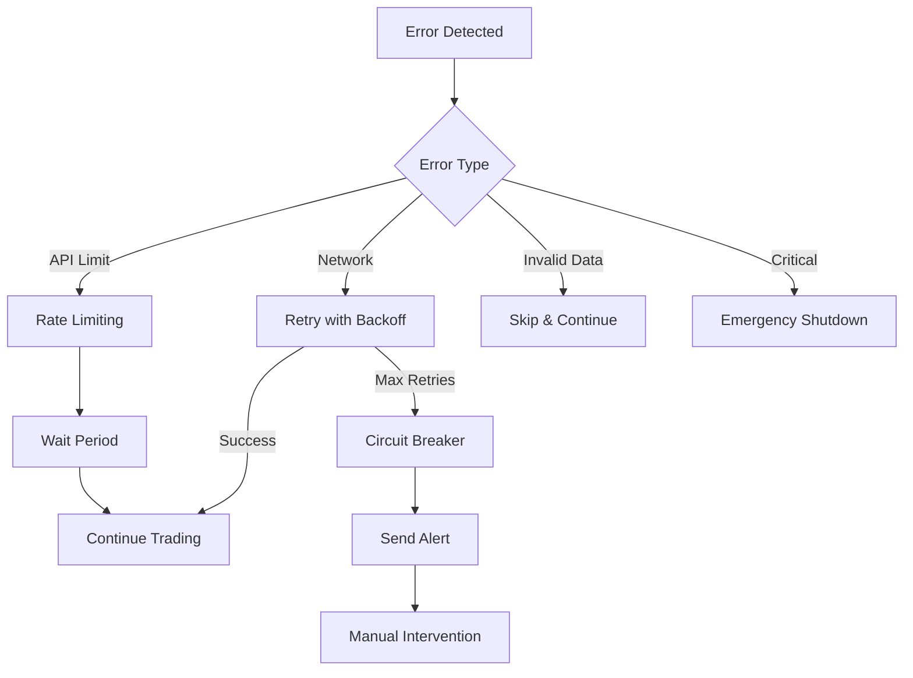
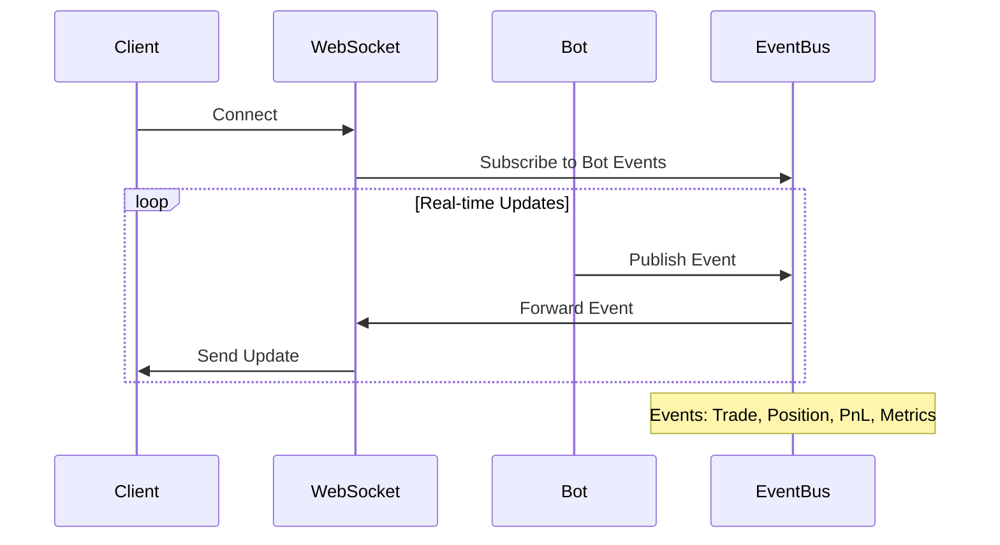

# T-Bot Trading Workflow

## Complete Trading Execution Flow



## Detailed Trading Sequence



## Bot Lifecycle Management



## Signal Generation Process (From Actual Code)

### BaseStrategy Implementation
```python
# From src/strategies/base.py
class BaseStrategy(BaseComponent, BaseStrategyInterface):
    async def generate_signal(self, market_data: MarketData) -> Signal | None:
        """Generate trading signal based on market data."""

        # 1. Validate market data
        if not self._validate_market_data(market_data):
            return None

        # 2. Calculate technical indicators
        indicators = await self._calculate_indicators(market_data)

        # 3. Apply strategy logic
        signal = await self._apply_strategy_logic(indicators)

        # 4. Validate signal confidence
        if signal and signal.confidence < MIN_SIGNAL_CONFIDENCE:
            return None

        return signal
```

### Strategy Types (Actual Implementation)


## Risk Management Workflow



### Risk Calculations (From Actual Code)
```python
# From src/risk_management/core/calculator.py
class RiskCalculator:
    def calculate_position_size(self,
                              signal: Signal,
                              account_balance: Decimal,
                              risk_per_trade: Decimal) -> Decimal:
        """Calculate optimal position size based on risk parameters."""

        # 1. Calculate maximum risk amount
        max_risk = account_balance * risk_per_trade

        # 2. Calculate stop loss distance
        stop_distance = abs(signal.entry_price - signal.stop_loss)

        # 3. Calculate position size
        position_size = max_risk / stop_distance

        # 4. Apply maximum position limits
        max_position = account_balance * Decimal("0.02")  # 2% max

        return min(position_size, max_position)
```

## Order Execution Pipeline



### Order Types & Execution
```python
# From src/core/types/trading.py
class OrderType(Enum):
    MARKET = "market"
    LIMIT = "limit"
    STOP_LOSS = "stop_loss"
    TAKE_PROFIT = "take_profit"

class OrderSide(Enum):
    BUY = "buy"
    SELL = "sell"

class OrderStatus(Enum):
    PENDING = "pending"
    PARTIAL = "partial"
    FILLED = "filled"
    CANCELLED = "cancelled"
    REJECTED = "rejected"
```

## Performance Monitoring Loop



## Error Handling & Recovery



### Circuit Breaker Implementation
```python
# From src/error_handling/circuit_breaker.py
@with_circuit_breaker(failure_threshold=5, timeout=30)
async def place_order(order: OrderRequest) -> OrderResponse:
    """Place order with circuit breaker protection."""
    try:
        response = await exchange.place_order(order)
        return response
    except Exception as e:
        # Circuit breaker tracks failures
        raise
```

## WebSocket Real-Time Updates



---

## Next Steps

**Complete the documentation:**

1. **[Technology Stack](05_technology_stack.md)** - Technologies and frameworks
2. **[Module Structure](02_module_structure.md)** - Back to module details
3. **[Data Flow](03_data_flow.md)** - Back to data processing
4. **[Back to Overview](00_overview.md)** - Return to index

What would you like to explore next? (Choose 1-4)