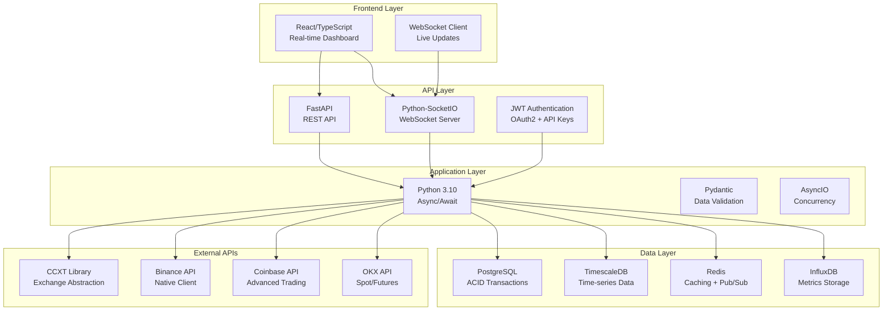
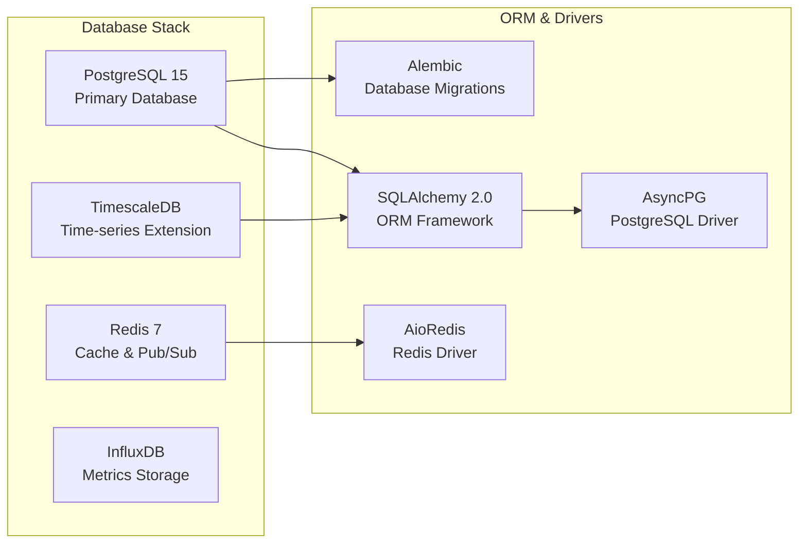
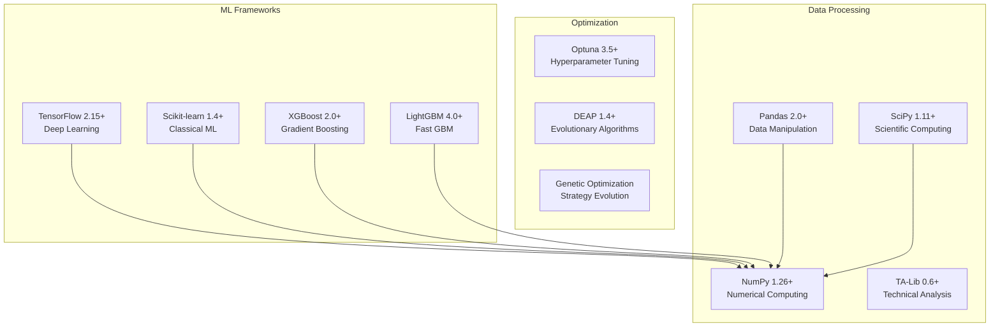
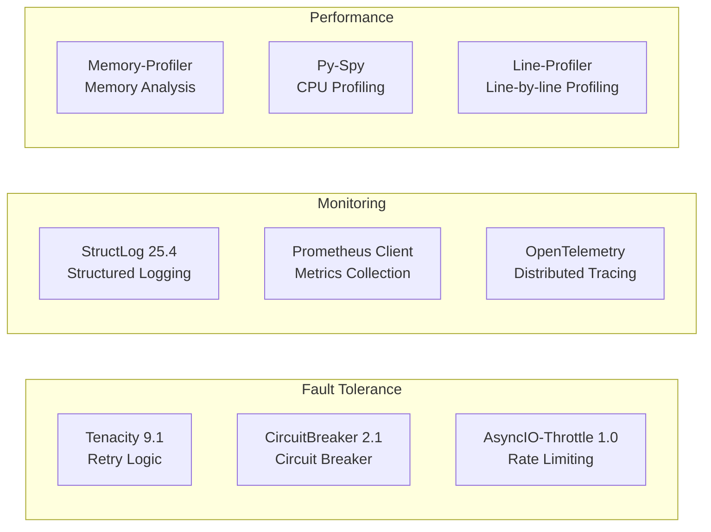
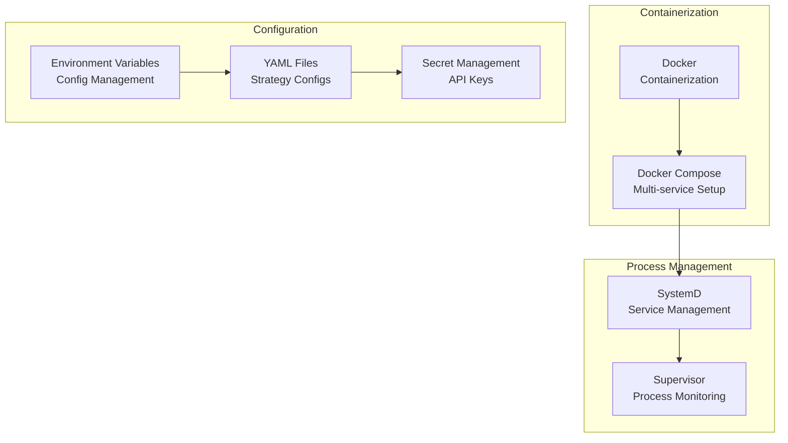
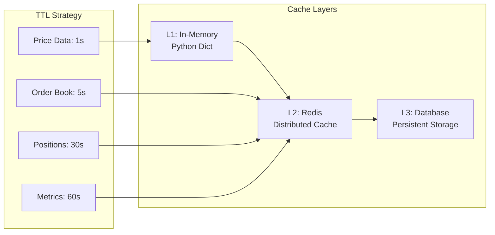
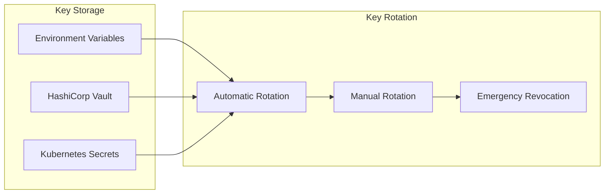
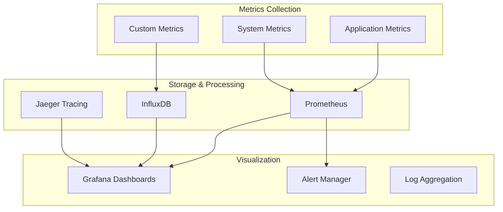

# T-Bot Technology Stack

## Technology Overview



## Core Technology Components

### Programming Language & Runtime
| Technology | Version | Purpose |
|------------|---------|---------|
| **Python** | 3.10.12 | Core application language |
| **AsyncIO** | Built-in | Asynchronous programming |
| **Type Hints** | Python 3.10+ | Static type checking |
| **Virtual Environment** | venv | Dependency isolation |

### Web Framework & API
| Technology | Version | Purpose |
|------------|---------|---------|
| **FastAPI** | 0.104.0+ | REST API framework |
| **Uvicorn** | 0.24.0+ | ASGI server |
| **Python-SocketIO** | 5.11.0+ | WebSocket communication |
| **Pydantic** | 2.11.7 | Data validation & serialization |
| **Python-Jose** | 3.3.0+ | JWT token handling |
| **BCrypt** | 4.0.1 | Password hashing |

### Database Technologies


### Exchange Integration
| Exchange | Library | Version | Features |
|----------|---------|---------|----------|
| **Multiple** | CCXT | 4.4.98 | Unified exchange API |
| **Binance** | python-binance | 1.0.29 | Native Binance integration |
| **Coinbase** | coinbase-advanced-py | 1.8.2 | Advanced trading features |
| **OKX** | okx | 2.1.2 | Spot & futures trading |
| **WebSocket** | websockets | 12.0+ | Real-time data streams |

### Machine Learning & Analytics


### Technical Analysis Stack
| Library | Version | Purpose |
|---------|---------|---------|
| **TA-Lib** | 0.6.6+ | Technical indicators |
| **NumPy** | 1.26.4+ | Numerical arrays |
| **Pandas** | 2.0+ | Data frames |
| **Matplotlib** | 3.8.0+ | Plotting & visualization |
| **Seaborn** | 0.13.0+ | Statistical visualization |

### Error Handling & Resilience


### Development & Testing
| Tool | Version | Purpose |
|------|---------|---------|
| **pytest** | 8.4.1 | Testing framework |
| **pytest-asyncio** | 1.1.0 | Async test support |
| **Black** | 25.1.0 | Code formatting |
| **Flake8** | 7.3.0 | Linting |
| **MyPy** | 1.17.1 | Static type checking |
| **pytest-timeout** | 2.4.0 | Test timeouts |

### Deployment & Infrastructure


### Network & Communication
| Protocol | Implementation | Usage |
|----------|----------------|-------|
| **HTTP/HTTPS** | aiohttp, requests | REST API calls |
| **WebSocket** | websockets, python-socketio | Real-time data |
| **TCP/IP** | Built-in | Low-level networking |
| **JSON** | Built-in | Data serialization |
| **MessagePack** | Optional | Binary serialization |

## Performance & Scalability

### Async Architecture
```python
# Core async patterns used throughout
import asyncio
from typing import AsyncGenerator

async def process_market_data() -> AsyncGenerator[MarketData, None]:
    """Async generator for streaming data processing."""
    async for data in market_stream:
        validated_data = await validate_data(data)
        yield validated_data

# Concurrent execution
async def execute_strategies():
    """Run multiple strategies concurrently."""
    strategies = [strategy1, strategy2, strategy3]
    await asyncio.gather(*[s.run() for s in strategies])
```

### Caching Strategy


### Database Optimization
| Optimization | Technology | Implementation |
|--------------|------------|----------------|
| **Time-series** | TimescaleDB | Hypertables with compression |
| **Indexing** | PostgreSQL | B-tree, Hash, GIN indexes |
| **Partitioning** | TimescaleDB | Automatic time-based partitioning |
| **Connection Pooling** | AsyncPG | Connection pool management |
| **Query Optimization** | SQLAlchemy | Query optimization & caching |

## Security Implementation

### Authentication & Authorization
```python
# JWT implementation
from jose import JWTError, jwt
from passlib.context import CryptContext

pwd_context = CryptContext(schemes=["bcrypt"], deprecated="auto")

class SecurityManager:
    def verify_token(self, token: str) -> dict:
        payload = jwt.decode(token, SECRET_KEY, algorithms=[ALGORITHM])
        return payload

    def hash_password(self, password: str) -> str:
        return pwd_context.hash(password)
```

### API Key Management


## Production Configuration

### Resource Requirements
| Component | CPU | Memory | Storage | Network |
|-----------|-----|--------|---------|---------|
| **API Server** | 2 cores | 4GB RAM | 20GB SSD | 1Gbps |
| **Trading Bot** | 4 cores | 8GB RAM | 50GB SSD | 1Gbps |
| **Database** | 4 cores | 16GB RAM | 500GB SSD | 1Gbps |
| **Redis Cache** | 2 cores | 8GB RAM | 20GB SSD | 1Gbps |
| **Total System** | 12 cores | 36GB RAM | 590GB SSD | 1Gbps |

### Monitoring Stack


---

## Architecture Documentation Complete

You now have complete architecture documentation covering:

✅ **[00_overview.md](00_overview.md)** - Main index and navigation
✅ **[01_system_architecture.md](01_system_architecture.md)** - High-level system design
✅ **[02_module_structure.md](02_module_structure.md)** - Detailed code organization
✅ **[03_data_flow.md](03_data_flow.md)** - Data processing pipelines
✅ **[04_trading_workflow.md](04_trading_workflow.md)** - Complete trading execution
✅ **[05_technology_stack.md](05_technology_stack.md)** - Technologies and frameworks

**[Return to Overview](00_overview.md)** to explore any section in detail!